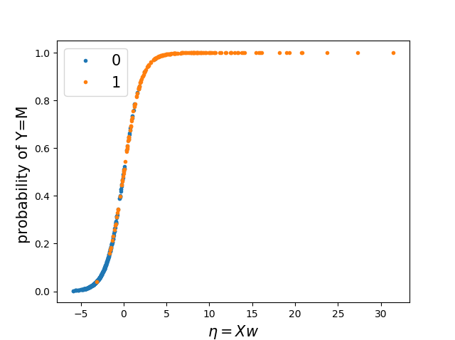

# breast-cancer-diagnosis

## Installation 
1. scikit-learn
2. pytorch

## Usage 
Implement logistic regression by scikit-learn and pytorch respectively. 

Input data: 10 imaging features from digitized image of breast mass.
Output: prediction of breast cancer diagnosis (1="malignant", 2="benign")

## Result

